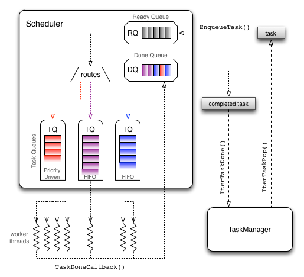

Module - EXE (Task Scheduling and Execution) {#modexe}
==================================

[TOC]

Tasks {#modexe-task}
======

(... what a task contains. diff between different Task subclasses, etc)

(... mapping task names to agent functions -- task registration) 

(... how tasks get access to agent memory and message boards)

Task Scheduling {#modexe-sched}
===============

The activation and scheduling of tasks is achieved through the interation between the
[Scheduler](@ref flame::exe::Scheduler) and the [TaskManager](@ref flame::exe::TaskManager).
At the beginning of an iteration, the Scheduler is populated with tasks that are ready for
immediate execution (no dependencies) after which the completion of each task triggers
the execution of callback functions that marks fulfilled dependencies and enqueues
further tasks that have all dependencies met. 

It should be noted that the process is completely governed by the registered 
dependencies of the tasks -- **a non-conforming dependency graph (e.g. a cyclic graph) will
result in an iteration that never completes**. 

The actual scheduling and execution of tasks is handled by 
[TaskQueues](@ref flame::exe::TaskQueue). Each queue registered with the Scheduler
will be assigned a [Task type](@ref flame::exe::Task::TaskType) and this determines how
enqueued tasks are routed to the appropriate `TaskQueue`.

Each `TaskQueue` will contain one or more [WorkerThreads](@ref flame::exe::WorkerThread)
whereby the number of worker threads determines the number of slots it has, i.e. the number 
of concurrent tasks it can execute. Each `TaskQueue` may use a different scheduling 
algorithm -- e.g. FIFO or Priority-driven -- to assign enqueued tasks to worker threads. 
Some `TaskQueues` can perform task splitting, i.e. splitting up a large task into smaller
ones so the load can be spread more evenly across all worker threads (see 
flame::exe::SplittingFIFOTaskQueue).

The different queues and scheduling mechanisms allow the framework to better utilise the
resources available. For example, a typical setup could be to use the following set of
`TaskQueues`: 
 * priority-driven queue for CPU-intensive tasks (such as agent functions) with 
 the number of worker threads matching the number of CPU cores
 * FIFO queue for I/O operations (e.g. writing output data to disk) with the number of 
 threads matching the maximum number of simultaneous writes that the I/O subsystem can 
 handle efficiently
 * FIFO queue for communication operations (e.g. message board syncs) with the number of
 threads determining the maximum number of simultaneous communications. 
 

For implementation details, see:
 * flame::exe::TaskManager
 * flame::exe::Scheduler
 * flame::exe::TaskQueue
 * flame::exe::SplittingFIFOTaskQueue
 

Worker Threads {#modexe-worker}
==============

