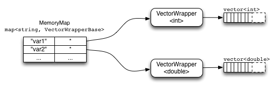

Module - MEM (Agent Memory Management) {#modmem}
==================================

[TOC]

Storage {#modmem-storage}
============

The flame::mem::AgentMemory class is used to store the memory of all
instances of agents of a specific type. Each memory variable type is stored in a
vector (one element per agent instance) which, under the hood, is contiguous in memory.

The different memory varaibles of an agent is stored within a
flame::mem::MemoryMap datatype -- a map with the memory variable name as a string-based 
key and a pointer to an instance of flame::mem::VectorWrapper as the values. 
The use of a map allows us to retrieve memory vectors at run-time using a string-based 
lookup key (the variable name).
The use of `VectorWrapper` allows us to store and reference vectors in a 
type-agnostic fashion so in most cases the framework does not need to know the datatype
behind each memory variable thus keeping the APIs clean and simple.

Instead of a standard std::map, `MemoryMap` is defined using boost::ptr_map. 
This allows the lifetime of the `VectorWrapper` objects to be handled automatically by
the containing object, i.e. all vectors are destroyed automatically when the 
`AgentMemory` instance is deleted.

During a simulation, an singleton instance of flame::mem::MemoryManager manages the 
collection of `AgentMemory` instances (one for each agent type). 
References to `AgentMemory` is store in a boost::ptr_map variable much like how 
`MemoryMap` is used but with the agent name as the key and a pointer to the `AgentMemory` 
as the mapped value.

At the framework level, this allows us access to specific memory vectors simply
by querying the `MemoryManager` for the agent name and memory variable name.

    #include "flame2/mem/memory_manager.hpp"
    #include "flame2/mem/vector_wrapper.hpp"

    // Get reference to the MemoryManager (singleton)
    flame::mem::MemoryManager& mgr = flame::mem::MemoryManager::GetInstance();

    // Get pointer to vectorwrapper storing all "x" values for agent "Circle"
    flame::mem::VectorWrapperBase *vw_ptr = mgr->GetVectorWrapper("Circle", "x");

For implementation details, see:
 * flame::mem::VectorWrapper
 * flame::mem::AgentMemory
 * flame::mem::MemoryManager